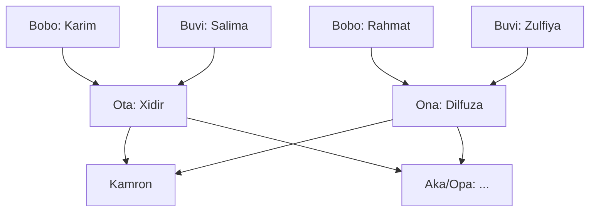

# Xidirovlar shajarasi

```mermaid
graph TD
    A["Bobo: Karim"] --> C["Ota: Xidir"]
    B["Buvi: Salima"] --> C
    D["Bobo: Rahmat"] --> E["Ona: Dilfuza"]
    F["Buvi: Zulfiya"] --> E
    C --> G["Kamron"]
    E --> G
    C --> H["Aka/Opa: ..."]
    E --> H
```
